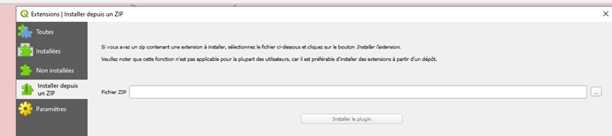
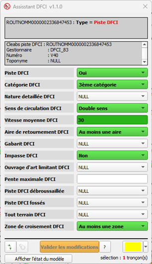
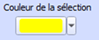
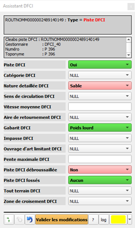

<table>
<colgroup>
<col style="width: 21%" />
<col style="width: 78%" />
</colgroup>
<tbody>
<tr>
<td rowspan="2"></td>
<td style="font-size: 24px;text-align: center;">
<strong>Manuel utilisateur du plugin
« Assistant DFCI »</strong>

<strong>V1.2.1</strong>
</td>
</tr>
<tr>
<td style="font-size: 16px;text-align: center;">Développeur  : Gérôme PECHEUR (IGN)</td>
</tr>
</tbody>
</table>

## Sommaire

- [1. Prérequis](#prerequis)
- [2. Résumé](#resume)
- [3. Installation](#installation)
- [4. Présentation](#presentation)
- [5. Mode de sélection](#mode-de-sélection)
  - [5.1 Sélection unique](#selection-unique)
  - [5.2 Sélection multiple](#selection-multiple)
- [6. Modification](#modification)
- [7. A propos de](#a-propos-de)
  

  

  <h2 id="prerequis" style="color: white;margin:0;" >1. Prérequis</h2>

Version de QGIS 3 : 3.28 ou supérieure.  
- Ce plugin fonctionne en parallèle du plugin « IGN Espace collaboratif »  
- Le plugin « maitre » doit préalablement être installé : 
[maitre-qgis-plugin sur GitHub](https://github.com/IGNF/maitre-qgis-plugin/releases/download/version_finale/plugin_maitre.zip) 
- Le plugin « Sens de numérisation » doit préalablement être installé : 
[sens_numerisation-qgis-plugin
](https://github.com/IGNF/sens_numerisation-qgis-plugin/releases/download/version_finale/IGN_sens_numerisation.zip) 
- Le plugin « Chemin le plus court » doit préalablement être installé : 
[chemin-le-plus-court-qgis-plugin
](https://github.com/IGNF/chemin-le-plus-court-qgis-plugin/releases/download/version_finale/IGN_chemin_le_plus_court.zip) 
- Ce plugin fonctionne uniquement avec des couches de la BDTopo, dans QGIS le nom de la couche route doit obligatoirement se nommer : « troncon_de_route ».  

Si le package « openpyxl » n’est pas installé sur le poste, le message d’erreur ci-dessous apparaît lors d’une transaction.  

 
	 

Remède : installation du package.  
Ouvrir l’invite de commande, se placer dans le répertoire « bin » de l’installation de QGIS :  
Exemple :  

 
	 

Puis taper la commande : python-qgis-ltr.bat -m pip install openpyxl  

 
	 

Le package s’installe, vous n’avez plus qu’à relancer QGIS.  

  <h2 id="resume" style="color: white;margin:0;" >2. Résumé</h2>

 
  
Ce plugin est une aide à la modification des attributs sémantiques des « complexes DFCI ».  
  
  
  

  <h2 id="installation" style="color: white;margin:0;" >3. Installation</h2>

  
Ouvrir QGIS.  
Allez dans Extensions/Installer/Gérer les extensions, cliquez sur Installer depuis un ZIP, sélectionner le fichier ZIP puis cliquez sur Installer le plugin.  

 
	 

  

  <h2 id="presentation" style="color: white;margin:0;" >4. Présentation</h2>

 
  
  

 
	 

  

Cette interface permet de modifier les attributs des champs DFCI des tronçons de routes  

Le bouton « ? » permet d’afficher le suivi des versions et permet également d’ouvrir la documentation du plugin  
Le bouton « log » permet d’afficher le rapport des modifications  
Le bouton  permet d’annuler la dernière modification effective et uniquement la dernière.  
Le bouton  permet de modifier la couleur des tronçons sélectionnés dans QGIS. Ça peut être utile suivant la symbologie appliquée pour les tronçons dans QGIS.  
Le bouton  permet la sélection de toutes les entités comprises entre deux tronçons.  

Le bouton « Valider les modifications » valide les modifications dans QGIS, le plugin « espace collaboratif » se charge d’impacter les bases BDTopo de l’IGN.  

 
	 

A l’ouverture de l’outil, il y a une vérification de la présence dans le projet des couches nécessaires. 
Afficher l’état du modèle permet de **vérifier les permissions sur chaque attribut.** 
Ces permissions sont définies dans le projet en fonction des guichets en saisie directe dans la BDTOPO.  
  

  <h2 id="mode-de-selection" style="color: white;margin:0;" >5. Mode de sélection</h2>

 

  <h2 id="selection-unique" style="color: white;margin:0;" >5.1 Sélection unique</h2>

Les attributs affichés sont ceux du tronçon sélectionné.  
En vert lorsqu’ils sont différents de « NULL » ou de vide.  

  <h2 id="selection-multiple" style="color: white;margin:0;" >5.2 Sélection multiple</h2>

- Sélection multiple avec l’outil de saisie. Dans QGIS on peut sélectionner manuellement un ensemble de tronçons  

- Sélection multiple de tronçons contigües, on sélectionne 2 tronçons, <mark>ces 2 tronçons doivent être visible à l’écran et être connectés.</mark>  
Ensuite, on clique sur le bouton , le résultat est une sélection de tous les tronçons entre les deux tronçons sélectionnés, respectant l’algorithme du chemin le plus court.  
Un contrôle visuel est toutefois nécessaire, afin de vérifier si les tronçons sont bien ceux désirés.  

Seuls les attributs communs à tous les tronçons sont représentés en vert.  

  

  <h2 id="modification" style="color: white;margin:0;" >6. Modification</h2>

Une fois les tronçons sélectionnés, il suffit de choisir le ou les attributs à modifier parmi les valeurs possibles ou éditables.  

 
	 

Les valeurs en rose sont celles qui seront modifiées pour tous les tronçons sélectionnés.  

Les modifications sur le(s) tronçon(s) sélectionné(s) sont à valider avec le bouton   
Un message QGIS confirme la prise en compte des modifications.  
  

 
	 

  <h2 id="extra" style="color: white;margin:0;" >7. Extra</h2>

Accessible via le bouton   

 

 
	 

  

Cette boîte permet de suivre l’historique des différentes versions ainsi que d’afficher la documentation.  